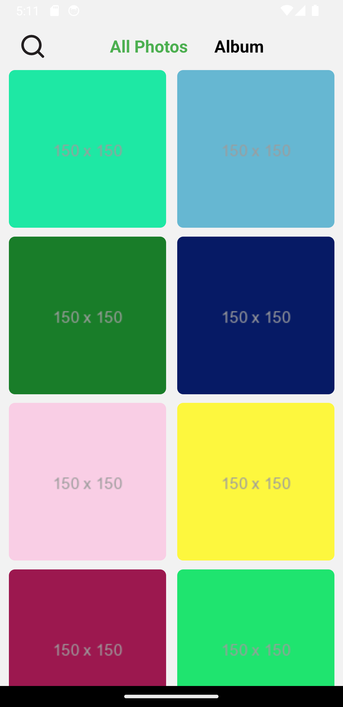
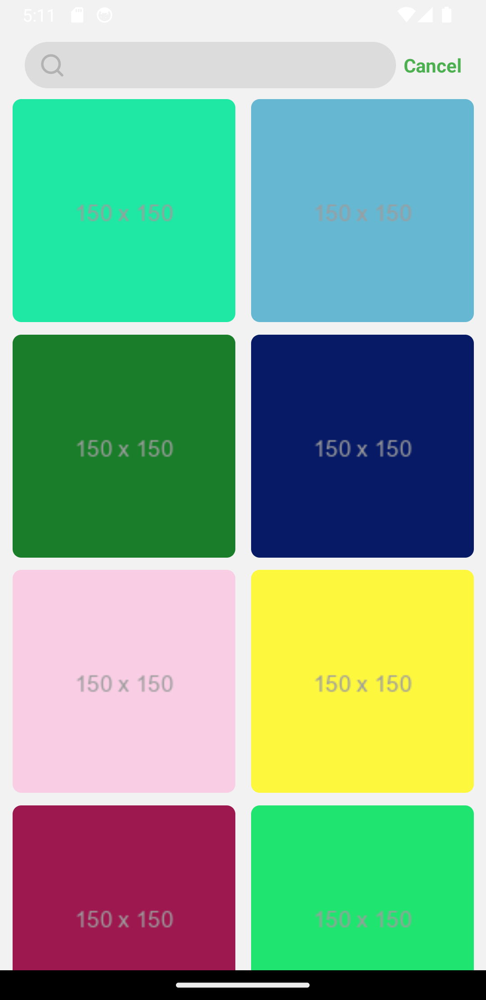
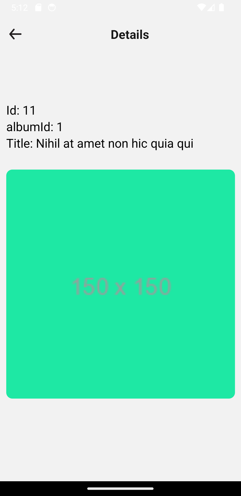
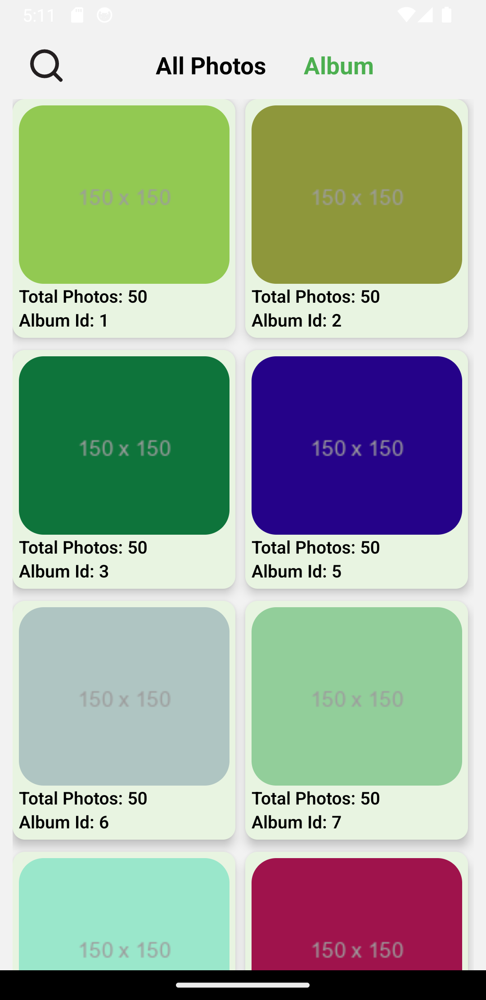
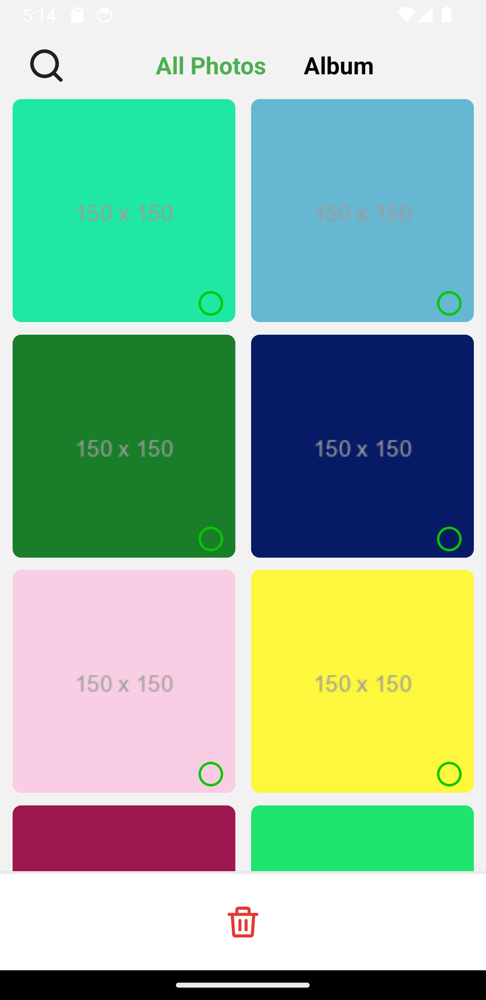
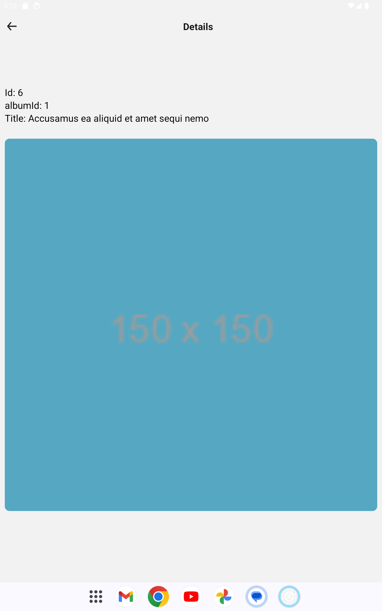
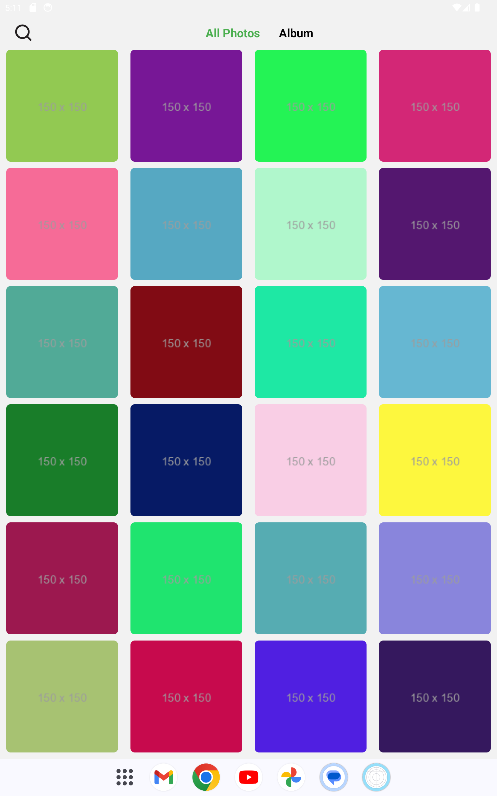
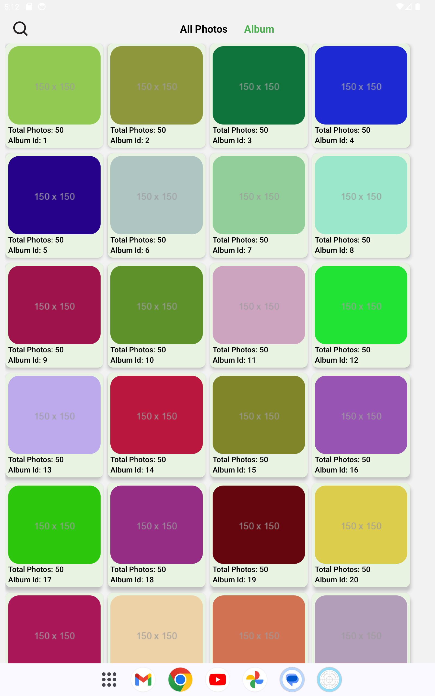
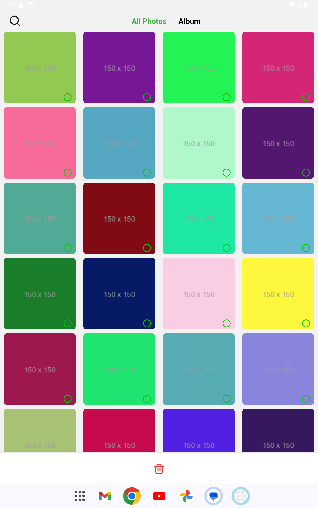

# Welcome to the Mobile Gallery App 👋

This is a mobile gallery app built with React Native and Expo, featuring image fetching, offline caching, lazy loading, and more. The app is optimized for both Android and iOS devices, including tablets, with a responsive layout.

## Project Overview

| #SL | Name                     | File                                                                          | Demo                                    |
| --- | ------------------------ | ----------------------------------------------------------------------------- | --------------------------------------- |
| 01  | React Native Gallery App | [Apk](https://drive.google.com/file/d/1iX4D5_LcfsifsOmj6KNoat47D9JNk-zK/view) | [Youtube](https://youtu.be/kzs7PHC1hQM) |

## Features

- **Fetch Images**: Images are fetched from JSONPlaceholder with pagination support (10 images per page).
- **State Management**: All network requests are handled using Redux Toolkit and RTK Query, ensuring efficient state management and data caching.
- **Optimistic and Pessimistic Updates**: The app implements both optimistic and pessimistic updates for a seamless user experience.
- **Lazy Loading**: Images are lazily loaded as the user scrolls, optimizing performance and reducing data usage.
- **Image Deletion**: Long-press on an image to delete it by image ID or album ID.
- **Offline Caching**: Images are cached for offline access, allowing users to view previously loaded images without an internet connection.
- **Search Functionality**: Users can search for specific images within the gallery.
- **Responsive Layout**: The app uses Flexbox for a responsive layout, ensuring a consistent experience across mobile phones and tablets.
- **Cross-Platform**: Available on both Android and iOS platforms.

## Technologies Used

- **React Native**
- **Expo**
- **Redux Toolkit**
- **RTK Query**

## How to Use

- **Fetching Images**: The app automatically fetches and displays images when opened. Scroll down to load more images.
- **Deleting Images**: Long-press on an image to delete it. You can delete by either image ID or album ID.
- **Searching**: Use the search bar to find specific images in the gallery.

## Get started

1. Install dependencies

   ```bash
   git clone https://github.com/DeveloperRejaul/mobile-gallery-app.git
   cd mobile-gallery-app
   npm install or yarn
   ```

2. Start the app

   ```bash
   npm run prebuild  or yarn prebuild

   // run on android
   npm run android or yarn android

   // run on ios
   npm run ios or yarn ios

   ```

## Demo of Gallery App Mobile

<p>





</p>

## Demo of Gallery App tablet

<p>





</p>
